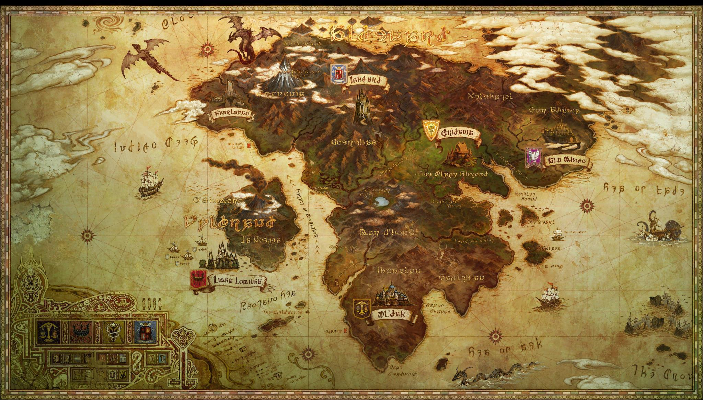

# Eorzea Gloabl

The full logistics manager for all transportation and services within Eorzea.

## Setup

[Setup](./SETUP.md)

## Following

https://ewanvalentine.io/microservices-in-golang-part-1/

## Recommended reading

- [gRPC Go](https://blog.gopheracademy.com/advent-2017/go-grpc-beyond-basics/)
- [Intro to HTTP2](https://developers.google.com/web/fundamentals/performance/http2/)

## Using

- Golang
- [go-micro](https://github.com/asim/go-micro)
- gRPC
- Protobuf

This is a study project to understand more about Go and how it's used in microservices. Further docs and readings that I'll be creating can be found in the `docs/` directory.

These will be both for general Go learnings and for aspects related to micro-services.

## Guidance

To understand the flow of these applications I am adding numbers as so `1.`, `2.` and so on to direct what is going on for my feeble brain when I return.

Things that are highlighted in the docs will be marked with `DOCS~`.

Anything that still neds to be understood and looked into will be marked with `TODO~`.

## Alternative Implementations

The idea behind the tutorial in following is to use go-micro.

After this is complete, I'm going to attempt to set something up using [go-kit](https://github.com/go-kit/kit) to see the differences.
